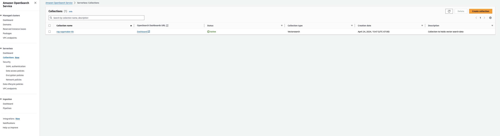
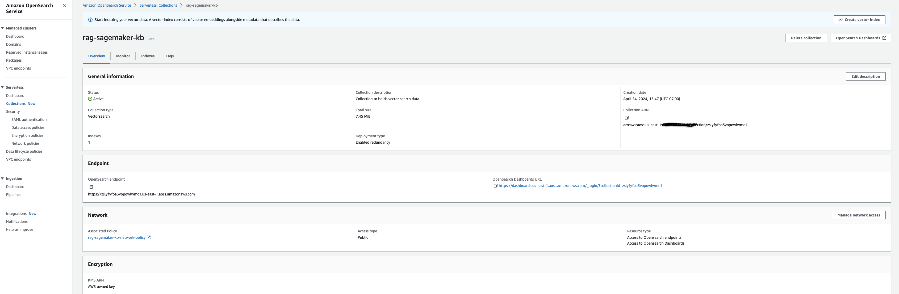
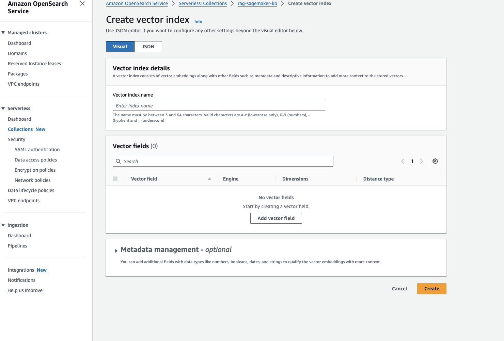

# Bedrock Knowledgebase Contextual Embedding Demo

# Title

Quickly build a contextual embedding demo using Amazon Bedrock KnowledgeBase and OpenSearch Serverless. 

# Introduction

TODO

# Solution Overview

TODO

# Deployment Guide 

In the following sections, we discuss the key steps to deploy the solution, including pre-deployment and post-deployment.

# Pre-Deployment
An AWS account to deploy the resources. Please use the link to sign-up if you do not have an account [AWS
account](https://signin.aws.amazon.com/signin?redirect_uri=https%3A%2F%2Fportal.aws.amazon.com%2Fbilling%2Fsignup%2Fresume&client_id=signup)

**Note** Navigate to Amazon Bedrock Console and ensure that you have access to the models you are going to use in this solution

Clone the repository using the command 
git clone <Paste the REPOSITORY URL>

# Deployment Steps
The solution deployment automation script uses two parameterized CloudFormation template, OpenSearch_serverless.yml and AmazonBedrock_kb_agents.yml, to automate provisioning of following solution resources:

 1. OpenSearch Service Serverless collection
 2. Amazon S3 Bucket (DataSource and IntermediateStorage)
 3. Amazon Bedrock KnowledgeBase
 4. IAM Roles
 5. AWS Lambda Function

# Cloudformation to deploy OpenSearch_serverless.yml stack
AWS CloudFormation prepopulates stack parameters with the default values provided in the template except for ARN of the IAM role with which you are
currently logged into your AWS account which you’d have to provide. To provide alternative input values, you can specify parameters as environment variables that are referenced in the `ParameterKey=<ParameterKey>,ParameterValue=<Value>` pairs in the following shell script’s `aws cloudformation create-stack --stack-name <stack-name> --template-body file://OpenSearch_serverless.yml --parameters ParameterKey=<parameter key>,ParameterValue=<parameter value> ParameterKey=<parameter key>,ParameterValue=<parameter value>` ....

Once the Cloudformation stack creation is successful navigate to the Output section of the stack and grab the following output values AmazonBedrockExecutionRoleForKnowledgeBasearn , AOSSVectorIndexName, CollectionArn, DataSourceS3Bucket, DataSourceS3BucketName, IntermediateS3BucketName, TransformationLambdaFunctionArn. We will use these values as parameters for our next stack AmazonBedrock_knowledge_base.yml to deploy Amazon Bedrock Knowledgebase and agents.

# Create Vector index in OpenSearch Serverless
The previous CloudFormation stack creates OpenSearch Service Serverless collection,but the next step will require us to create a vector index in OpenSearch Service Serverless collection. Follow the steps outlined below : 

1.  Navigate to OpenSearch Service console and click on `Collections`.
    The `rag-sagemaker-kb` collection created by the CloudFormation stack
    will be listed there.

    <figure>
    
    <figcaption aria-hidden="true">Figure 3: SageMaker Knowledge Base
    Collection</figcaption>
    </figure>

2.  Click on the `rag-sagemaker-kb` link to create a vector index for
    storing the embeddings from the documents in S3.

    <figure>
    
    <figcaption aria-hidden="true">Figure 4: SageMaker Knowledge Base Vector
    Index</figcaption>
    </figure>

3. Grab the vector index name from the output values of the previous stack, the default value is`rag-sagemaker-readthedocs-io`. Input the vector
    field name as `vector` dimensions as `1536`, choose  engine types as `FAISS` and distance metric as
    `Euclidean`. **It is required that you set these parameters exactly
    as mentioned here because the Bedrock Knowledge Base Agent is going
    to use these same values**.
  
   <figure>
    
    <figcaption aria-hidden="true">Figure 5: SageMaker Knowledge Base Vector
    Index Parameters</figcaption>
    </figure>

4.  Once created the vector index is listed as part of the collection.

    <figure>
    
    <figcaption aria-hidden="true">Figure 6: SageMaker Knowledge Base Vector
    Index Created</figcaption>
    </figure>

# CloudFormation to deploy AmazonBedrock_kb_agents.yml

Deploy the next stack using the following commands to provision the resources in your AWS account. 

`aws cloudformation create-stack --stack-name <stack-name> --template-body file://AmazonBedrock_kb_agents.yml --parameters ParameterKey=<parameter key>,ParameterValue=<parameter value> ParameterKey=<parameter key>,ParameterValue=<parameter value>` ....

**Note** , grab the values of parameters from the output of the previous stack.Use these keys, **AmazonBedrockExecutionRoleForKnowledgeBasearn , AOSSVectorIndexName, CollectionArn, DataSourceS3Bucket, DataSourceS3BucketName, IntermediateS3BucketName, TransformationLambdaFunctionArn** and the corresponding output values from previous stack to pass it as parameters when you are trying to create the 2nd stack 

# Test the RAG App on AWS Console
1. Navigate to S3 console and upload your test files into DataSourceS3Bucket
2. Navigate to Bedrock Console and click on Bedrock Knowledge base.
3. Click on the knowledge base you just created.
4. Select the data source and click on Sync button at top right
5. Once sync is complete. Start testing using the test window on the right
